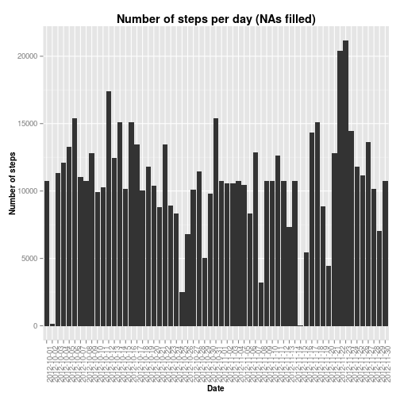

### Reproducible Research: Peer Assessment 1


First, load the libraries required for reproducing this code.


```r
library(dplyr)
library(ggplot2)
```

Read the data with `read.csv`. The first part of the project does not require the entries without data, so create a subset without NA values.


```r
activity <- read.csv("activity.csv", header = TRUE, na.strings = "NA", stringsAsFactors = FALSE)
activity_nona <- activity[!is.na(activity$steps), ]
activity_nona <- tbl_df(activity_nona)

activity_nona
```

```
## Source: local data frame [15,264 x 3]
## 
##    steps       date interval
## 1      0 2012-10-02        0
## 2      0 2012-10-02        5
## 3      0 2012-10-02       10
## 4      0 2012-10-02       15
## 5      0 2012-10-02       20
## 6      0 2012-10-02       25
## 7      0 2012-10-02       30
## 8      0 2012-10-02       35
## 9      0 2012-10-02       40
## 10     0 2012-10-02       45
## ..   ...        ...      ...
```


## What is mean total number of steps taken per day?
To find out the total number of steps taken per day, use the `group_by` and `summarise` functions in the `dplyr` package to create a new table data frame.


```r
steps_per_day <- group_by(activity_nona, date) %>%
    summarise(tot_steps = sum(steps))

steps_per_day
```

```
## Source: local data frame [53 x 2]
## 
##          date tot_steps
## 1  2012-10-02       126
## 2  2012-10-03     11352
## 3  2012-10-04     12116
## 4  2012-10-05     13294
## 5  2012-10-06     15420
## 6  2012-10-07     11015
## 7  2012-10-09     12811
## 8  2012-10-10      9900
## 9  2012-10-11     10304
## 10 2012-10-12     17382
## ..        ...       ...
```


From this table, the mean and median number of steps taken per day can be calculated.


```r
print(paste("Mean: ", round(mean(steps_per_day$tot_steps), digits = 2)))
```

```
## [1] "Mean:  10766.19"
```

```r
print(paste("Median: ", median(steps_per_day$tot_steps)))
```

```
## [1] "Median:  10765"
```

A plot of total number of steps taken each day as a histogram


```r
ggplot(data = steps_per_day, aes(x = date, y = tot_steps)) +
    geom_histogram(stat = "identity") +
    xlab("Date") + ylab("Number of steps") + 
    ggtitle("Number of steps per day (NAs removed)") +
    theme(plot.title = element_text(face = "bold"), 
          axis.text.x = element_text(angle = 90),
          axis.title.x = element_text(size = "10", face = "bold"), 
          axis.title.y = element_text(size = "10", face = "bold"))
```

 


## What is the average daily activity pattern?
To calculate the average steps five-minute interval, a similar process to the above grouping and summarising is used. Group the data by time, and for each interval calculate the mean.


```r
steps_per_interval <- group_by(activity_nona, interval) %>%
    summarise(mean_steps = mean(steps))

steps_per_interval
```

```
## Source: local data frame [288 x 2]
## 
##    interval mean_steps
## 1         0  1.7169811
## 2         5  0.3396226
## 3        10  0.1320755
## 4        15  0.1509434
## 5        20  0.0754717
## 6        25  2.0943396
## 7        30  0.5283019
## 8        35  0.8679245
## 9        40  0.0000000
## 10       45  1.4716981
## ..      ...        ...
```

A time-series (or line) plot of the average number steps taken per interval


```r
ggplot(data = steps_per_interval, aes(x = interval, y = mean_steps)) +
    geom_line() + xlab("Interval") + ylab("Number of steps (mean)") + 
    ggtitle("Mean steps per interval") +
    theme(plot.title = element_text(face = "bold"),           
          axis.title.x = element_text(size = "10", face = "bold"), 
          axis.title.y = element_text(size = "10", face = "bold"))
```

 

With the data above, find the 5-minute interval with the most number of steps take, on average.


```r
max_of_means = max(steps_per_interval$mean_steps)
int_max_steps <- steps_per_interval$interval[steps_per_interval$mean_steps == max_of_means]

print(int_max_steps)
```

```
## [1] 835
```

## Imputing missing values

Now, we come to the part where we need to use a method to take into account all those times for which we don't have the data. For this project, we choose to insert for each interval without data, the corresponding 5-minute mean calculated in the previous section. We also create a new data frame for this task.


```r
activity_filled <- tbl_df(activity)

## Indices of rows with NAs in the original data set
na_index <- which(is.na(activity$steps))

for (i in na_index) {
    interval <- activity$interval[i]
    activity_filled$steps[i] <- round(steps_per_interval$mean_steps[steps_per_interval$interval == interval], digits = 2)
}

activity_filled
```

```
## Source: local data frame [17,568 x 3]
## 
##    steps       date interval
## 1   1.72 2012-10-01        0
## 2   0.34 2012-10-01        5
## 3   0.13 2012-10-01       10
## 4   0.15 2012-10-01       15
## 5   0.08 2012-10-01       20
## 6   2.09 2012-10-01       25
## 7   0.53 2012-10-01       30
## 8   0.87 2012-10-01       35
## 9   0.00 2012-10-01       40
## 10  1.47 2012-10-01       45
## ..   ...        ...      ...
```


With the filled-in data set, we create another data frame grouped by date and providing the total number of steps taken per day.


```r
steps_per_day_filled <- group_by(activity_filled, date) %>%
    summarise(tot_steps = sum(steps))

steps_per_day_filled
```

```
## Source: local data frame [61 x 2]
## 
##          date tot_steps
## 1  2012-10-01  10766.13
## 2  2012-10-02    126.00
## 3  2012-10-03  11352.00
## 4  2012-10-04  12116.00
## 5  2012-10-05  13294.00
## 6  2012-10-06  15420.00
## 7  2012-10-07  11015.00
## 8  2012-10-08  10766.13
## 9  2012-10-09  12811.00
## 10 2012-10-10   9900.00
## ..        ...       ...
```


Make a historgram again, to compare the data sets...


```r
ggplot(data = steps_per_day_filled, aes(x = date, y = tot_steps)) +
    geom_histogram(stat = "identity") +
    xlab("Date") + ylab("Number of steps") + 
    ggtitle("Number of steps per day (NAs filled)") +
    theme(plot.title = element_text(face = "bold"), 
          axis.text.x = element_text(angle = 90),
          axis.title.x = element_text(size = "10", face = "bold"), 
          axis.title.y = element_text(size = "10", face = "bold"))
```

 


...and re-calculate the mean and median. (Notice that there isn't an appreciable difference between the data sets with and without missing data.)


```r
print(paste("Mean: ", round(mean(steps_per_day_filled$tot_steps), digits = 2)))
```

```
## [1] "Mean:  10766.18"
```

```r
print(paste("Median: ", median(steps_per_day_filled$tot_steps)))
```

```
## [1] "Median:  10766.13"
```


## Are there differences in activity patterns between weekdays and weekends?

Finally, to compare the activity between weekdays and weekends (taken to be both Saturday and Sunday), use the weekdays function in combination with a customised function to classify the days, as follows.


```r
dow <- weekdays(as.Date(activity_filled$date), abbreviate = TRUE)

weekend <- function(x) {
    if (x %in% c('Sat', 'Sun')) {
        return('Weekend')
    } else {
        return('Weekday')
    }
}

activity_filled$we <- as.character(lapply(dow, weekend))
```

We make use of the `activity_filled` data set since we need to access to five-minute interval data. Group by 'day type' and create line plots.


```r
af_dow <- activity_filled %>%
    group_by(we, interval) %>%
    summarise(mean_steps = mean(steps))

ggplot(data = af_dow, aes(x = interval, y = mean_steps)) +
    geom_line() + facet_grid(we ~ .) +
    xlab("Interval") + ylab("Mean number of steps") + 
    ggtitle("Comparison of Steps During Weekdays and Weekends") +
    theme(plot.title = element_text(face = "bold"),           
          axis.title.x = element_text(size = "10", face = "bold"), 
          axis.title.y = element_text(size = "10", face = "bold"))
```

 

The comparative plots show the obvious differences in steps taken during weekdays and weekends. On average, the first sharp increase occurs earlier in the day during weekdays. The peak number of steps, while occurring roughly at the same time, is considerably more during weekdays. However, during the rest of the active hours in the day, there appears to more number of steps during the weekends. Also, the active hours during weekends extend later into the day than during weekdays.
